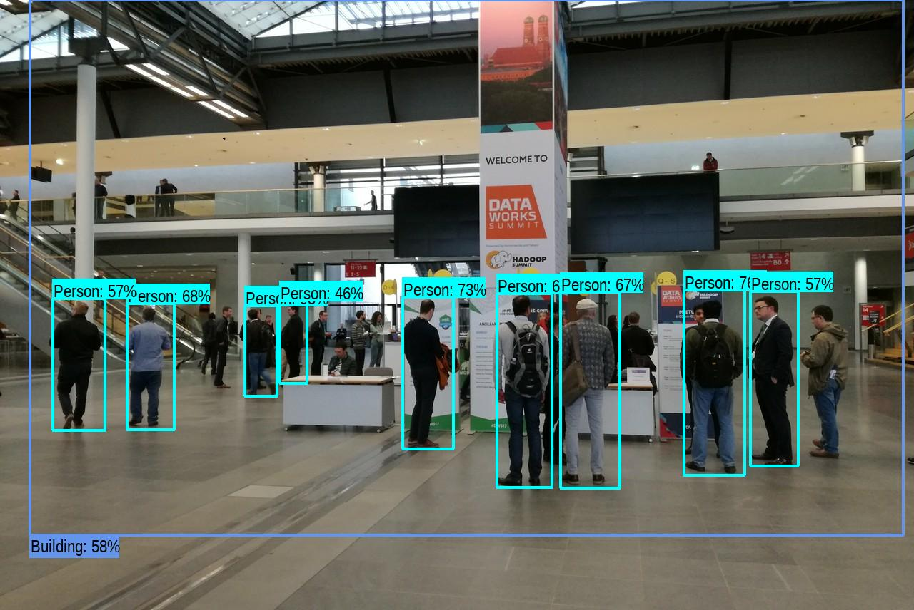
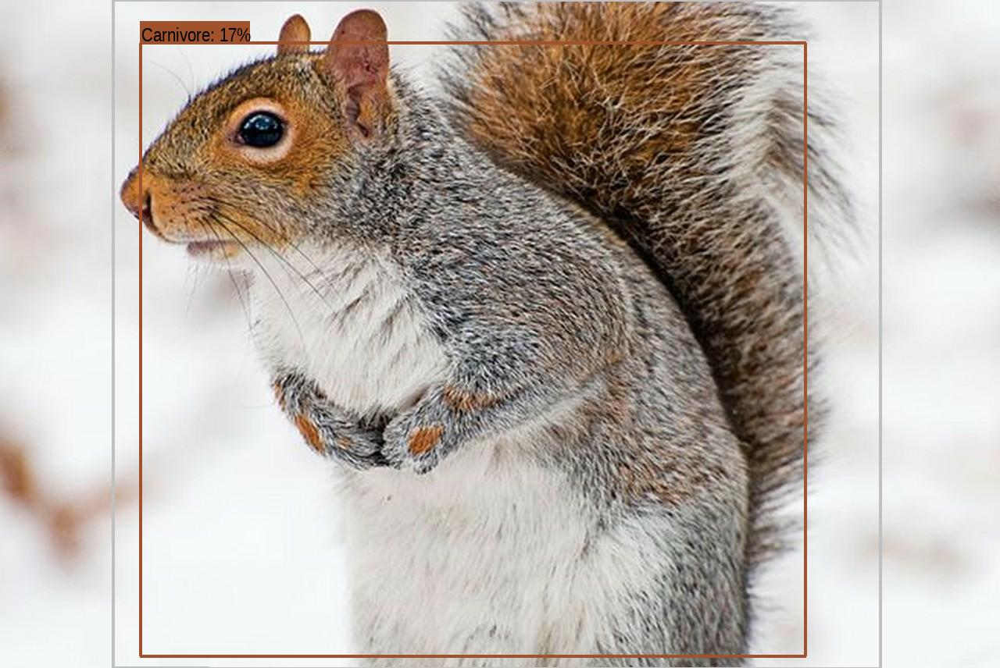
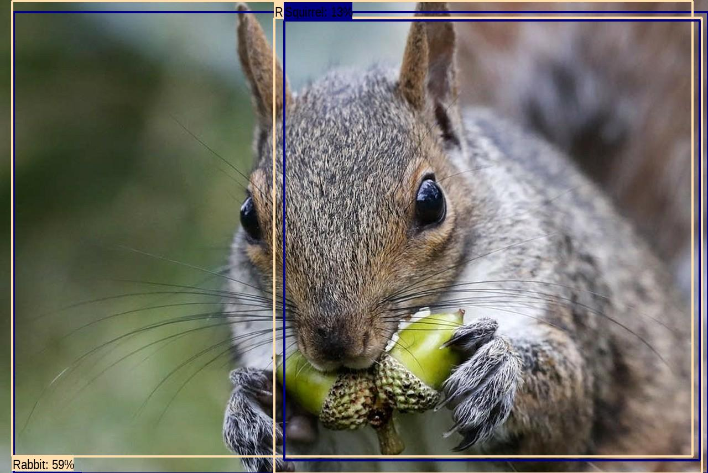

# TensorFlow Playground

Ensure that the environment you are using has:
- venv with
    - python3
    - pip3
    - numpy
    - matplotlib
    - tf-hub
    - tensorflow
s
Right now the script saves an image with bounded boxes to `/tmp/results/`

These are some of the results

Object Identification in DataWorks Summit, Berlin:

A squirrel which apparently is also a carnivore:

This one is tricky but it classified a squirrel as a rabbit and as a squirrel:

