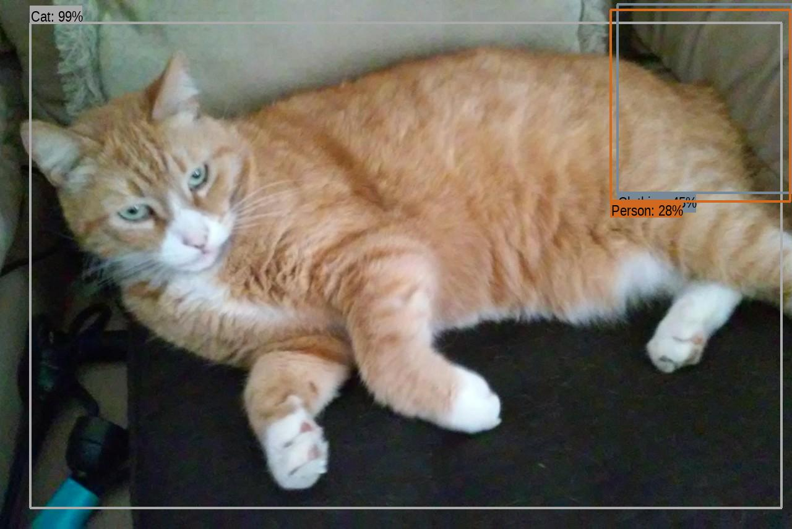

# TensorFlow Playground

Right now the script saves an image with bounded boxes to `/tmp/results/`

These are some of the results

Object Identification in DataWorks Summit, Berlin:

A squirrel which apparently is also a carnivore:

This one is tricky but it classified a squirrel as a rabbit and as a squirrel:

This cat has a person on his hind leg

## Get started

Ensure that the environment you are using has venv with:

- **python3**
- **numpy**
- **matplotlib**
- **tf-hub**
- **tensorflow**

Have dependencies installed preferably in a virtual environment

~~~bash
pip3 install virtualenv
~~~

Make and activate your environment

~~~bash
mkdir ~/venvtf
virtualenv ~/venvtf
~~~

Source and activate

~~~bash
source ~/venvtf/bin/activate
~~~

Now for the good stuff

~~~bash
brew install python3
pip3 install numpy
pip3 install tensorflow-hub
~~~
