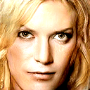

# Image Generation Using Progressive Generally Adversarial Networks

Image generator based on tensorflow reimplementation of Progressive GANs[1](https://tfhub.dev/google/progan-128/1).

## Training
The original model has been trained on a GPU for 636,801 steps with batch size 16. Progressive GAN trained on CelebA for 128x128 images, so if we want a different dataset we must retrain, instructions or specifications not provided here.

[Publishing](https://arxiv.org/abs/1710.10196)

This one gives a beatiful examples of Stochastic Gradient Descent, below is the output of the program's loss as a fucntion of time.

~~~python
5.607328
5.049135
2.7256744
0.7315302
1.4969169
0.8284514
1.1469302
1.4737284
0.780985
0.87809706
1.2609912
0.8296707
0.51274
0.76563483
0.28105795
1.0129179
1.3110291
0.95792377
0.1753838
0.3887029
0.22750023
0.20041952
0.38021433
0.14707488
0.8288853
0.95307875
0.49981752
~~~
