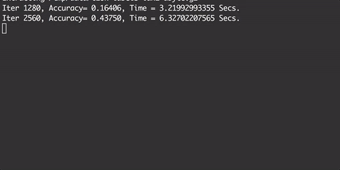
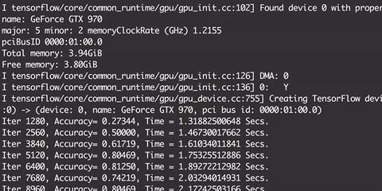

# Object Detection In 5 Minutes

## Introduction

Convolutional Neural Networks (CNNs) are [insert knowledge here]() and are used for [Drop Knowledge here]().

During the 2018 [DataWorks summit](Link) Hortonworks showcased an autonomous car which ... expand

The point of the exercise is to showcase the power of TensorFlow on Hadoop

### Why TensorFlow on YARN?

## Prerequisites

- Downloaded and deployed the [Hortonworks Data Platform (HDP)](https://hortonworks.com/downloads/#sandbox) Sandbox
- [TensorFlow on YARN](http://example.com/link/to/required/tutorial)

## Outline

- [Concepts](#concepts)
- [Environment Setup](#section-title-1)
- [Section Title 2](#section-title-2)
- [Summary](#summary)
- [Further Reading](#further-reading)
- [Appendix A: Troubleshoot](#appendix-a-troubleshoot)

## Concepts

To the human brain this is an elephant, albeit a fake one but an elephant nonetheless, we know this because we are able to make associations with previous shapes we have seen before and infer what type of animal it is we are observing.
Similarly in this tutorial we will explore how a computer envisions the world around it, at least when it has been trained.

We will employ [FasterRCNN+InceptionResNetV2](https://tfhub.dev/google/faster_rcnn/openimages_v4/inception_resnet_v2/1) network trained on [Open Images V4](https://storage.googleapis.com/openimages/web/index.html) imported to the environment using TensorFlow hub

## Environment Setup

### Import The Data set

Now that our environment has all the dependencies required we can bring in images to be processed.

Use Shell-In-A-Box to access the Sandbox VM:

~~~bash
sandbox-hdp.hortonworks.com:4200
~~~

Download the image data set:

~~~bash
wget github.com/raw-stuff-stuff
~~~

## Run The Object Detection Model

Now that your environment is set and you have some data to work with let's begin using the 

Navigate to Zeppelin Notebook at [sandbox-hpd.hortonworks.com:9995](http://sandbox-hdp.hortonworks.com:9995/) and import the Object Detection in 5 Minutes Notebook:

~~~bash
link to the notebook on gh in assets
~~~

## Summary

## Further Reading

- [Google Colab](https://example.com)
- [Object Detection](https://hortonworks.com)
- [TensorFlow on YARN](https://hortonworks.com/blog/distributed-tensorflow-assembly-hadoop-yarn/)
- [TensorFlow Documentation](tf.com)
- [TensorFlow Hub Documentation](tfhub.com)

### Appendix A: Detect objects with your own dataset

The appendix covers optional components of the tutorial, including help sections that might come up that cover common issues.  Either include possible solutions to issues that may occur or point users to [helpful links](https://hortonworks.com) in case they run into problems.

