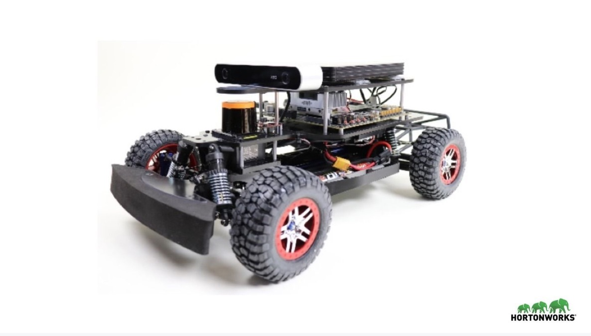
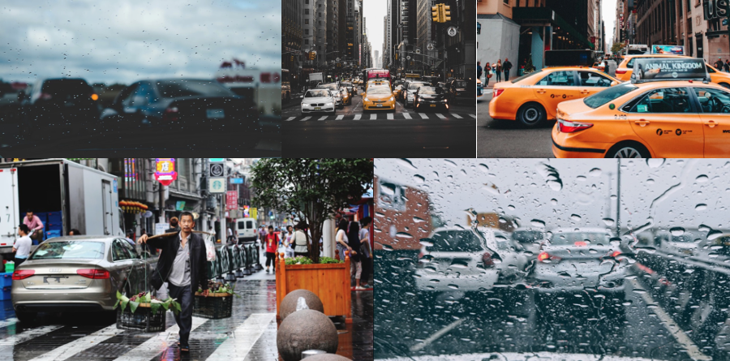
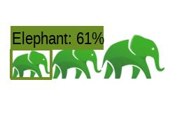
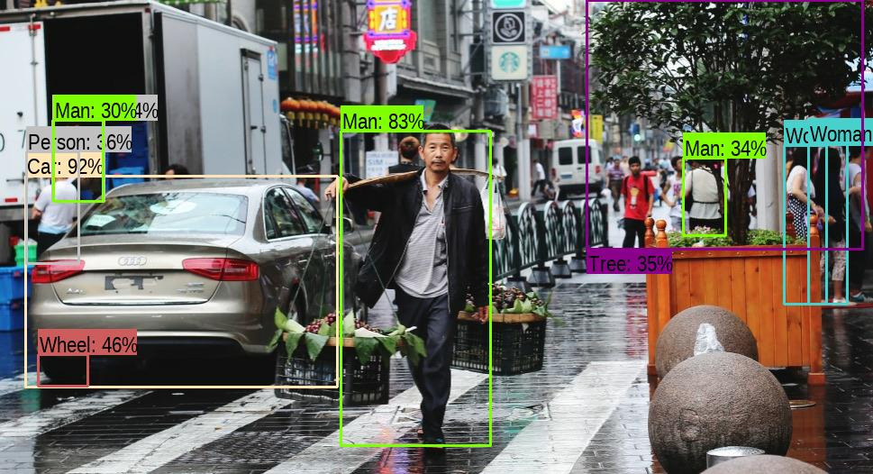
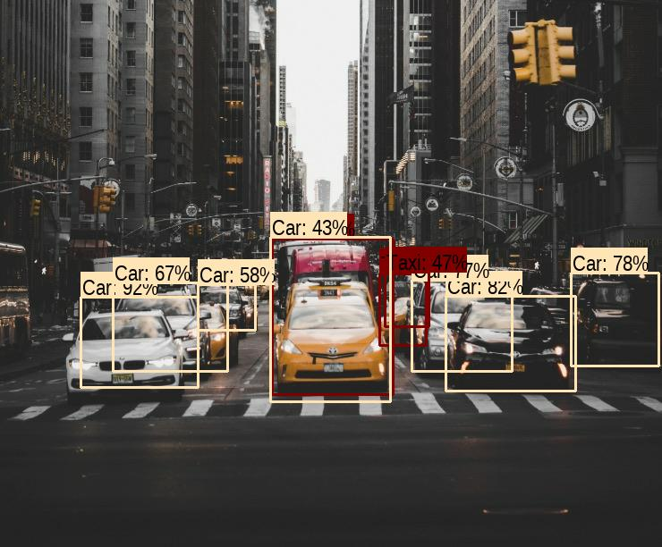
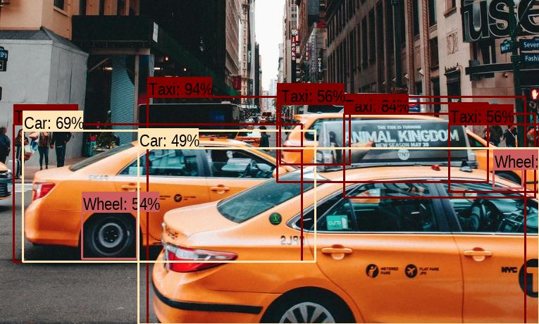
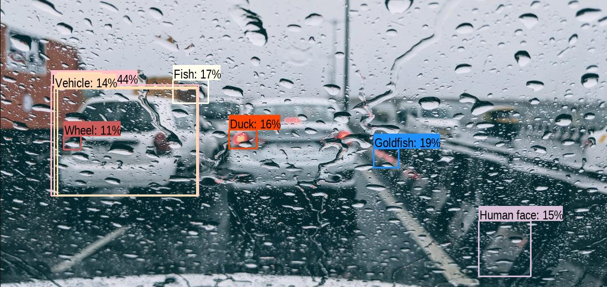
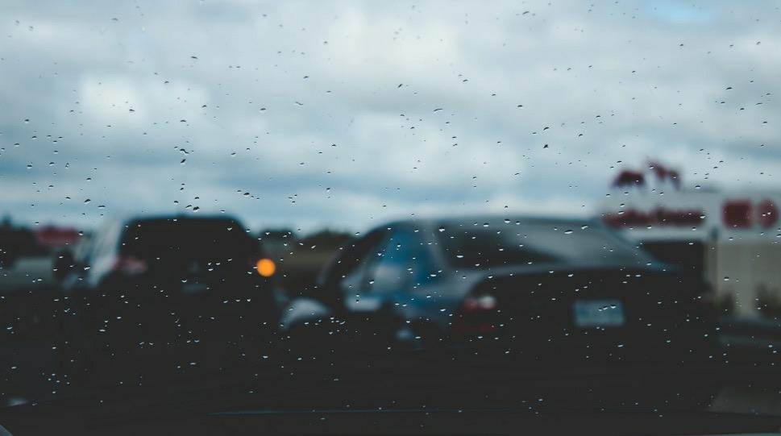
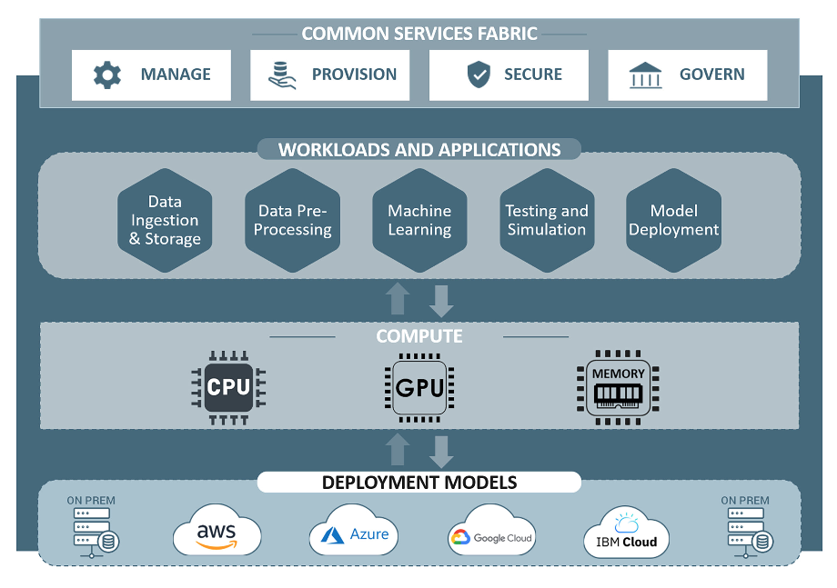

# Object Detection In 5 Minutes

## Introduction

During the 2018 [DataWorks summit](https://dataworkssummit.com/) Hortonworks showcased a miniature autonomous car which was trained to follow markers along a race track, the team achieved this by rapidly sampling photographs and using them to run inference to adjust the steering angle of the vehicle.

The point of the exercise is to showcase the power of a [TensorFlow container managed by YARN](https://www.youtube.com/watch?v=naLTAsy0tx8) along with GPU polling for fast deployment to the [Jetson TX2](https://developer.nvidia.com/embedded/buy/jetson-tx2) module aboard the miniature car. The model deployed was then used to gather more data which helped refine the model even further.

The clip below is an example of a classification model deployed on images collected by the Hortonworks miniature race car to recognize common objects around the Santa Clara, CA Hortonworks Headquarters. In fact, this is the same model that you will use in this tutorial to classify common objects.

In this tutorial we will explore the role that CNNs play in autonomous vehicles by using a pre-trained model to identify objects in a given image; furthermore, we will test the limit of the model--which was trained on ideal weather conditions--by changing the lighting and weather conditions of the input image to showcase how Deep Learning models are best when used with plenty of data it has seen before. If we want our model to be flexible we must gather as much data as possible from all driving conditions.

To achieve this we will employ [FasterRCNN+InceptionResNetV2](https://tfhub.dev/google/faster_rcnn/openimages_v4/inception_resnet_v2/1) network trained on [Open Images V4](https://storage.googleapis.com/openimages/web/index.html) imported to the environment using TensorFlow Hub. Originally the [InceptionResNetV2](https://www.tensorflow.org/versions/r1.6/api_docs/python/tf/keras/applications/InceptionResNetV2) feature extractor was trained on [ImageNet](http://www.image-net.org/) and combined with [FasterRCNN](https://arxiv.org/abs/1506.01497) on [OpenImages V4 dataset](https://storage.googleapis.com/openimages/web/index.html).

> NOTE: The python script used is a modified version of [Google's Colab Object Detection.](https://colab.research.google.com/github/tensorflow/hub/blob/master/examples/colab/object_detection.ipynb)

We will run CNN inferences to the images below and explore how difference lighting and weather conditions can affect the results of the inference.

## Prerequisites

- Downloaded and deployed the [Hortonworks Data Platform (HDP)](https://hortonworks.com/downloads/#sandbox) Sandbox
- [TensorFlow on YARN](http://example.com/link/to/required/tutorial)

## Outline

- [Concepts](#concepts)
- [Environment Setup](#environment-setup)
- [Import the Data Set](#import-the-data-set)
- [Run The Object Detection Model](#run-the-object-detection-model)
- [Role of Big Data](#role-of-big-data)
- [Summary](#summary)
- [Further Reading](#further-reading)
- [Appendix A: Troubleshoot](#appendix-a-troubleshoot)

## Concepts

### CNN Inference

In AI terms _Inference_ refers to the ability of a model to classify objects based on previously presented data. [Convolutional Neural Networks (CNNs)](https://en.wikipedia.org/wiki/Convolutional_neural_network) are a special type of network that is most efficient when working with image type data. To run inference with a CCN is to classify an image, or an object within an image, by using previously viewed data

To the human brain this is an image of an elephant, albeit a drawing of one but an elephant nonetheless, we know this because we are able to make associations with previous shapes we have seen before and infer what type of animal we are observing. By the same token the [inception_resnet_v2](https://tfhub.dev/google/faster_rcnn/openimages_v4/inception_resnet_v2/1) model has been trained on 600 categories (objects) which enable it to recognize things such as vehicles, humans, elephants, and even footwear based on previously seen image type data. The percentage displaced at the right of the object label is the percentage confidence that the prediction is correct.

## Environment Setup

You will need the following libraries installed:

- **python3**
- **numpy**
- **matplotlib**
- **tf-hub**
- **tensorflow**

~~~bash
sudo apt install python3-dev python3-pip
sudo pip3 install -U virtualenv 
~~~

~~~bash
virtualenv --system-site-packages -p python3 ./venv # From home direcotry
source ./venv/bin/activate

pip3 install numpy
pip3 install matplotlib
pip3 install tensorflow
pip3 install tf-hub
~~~

### Import The Data Set

Now that our environment has all the dependencies required we can bring in images to be processed.

Download the python script and data set that we will use for this tutorial:

~~~bash
cd ~/Downloads

wget github.com/raw-pythoncode

unzip objectDetection.zip

cd object-detection
~~~

## Run The Object Detection Model

To execute the python script that will execute the inference on the sample images first ensure that your virtual environment is active:

~~~bash
source ~/venv/bin/activate
cd ~/Downloads/objectDetection/
~~~

next execute the python script on the folder you've just downloaded

~~~bash
python3 objectDetectionLocal.py --idir ~/Downloads/object-detection/images/ --odir ~/Downloads/object-detection/output/ --type jpg
~~~

While the model is running inference on the sample images you should see an output like this:

~~~python
bad-condition.jpg
Found 100 objects.
man-walking.jpg
Found 100 objects.
bad-condition2.jpg
Found 0 objects.
good-lighting-traffic2.jpg
Found 10 objects.
good-lighting-traffic.jpg
Found 100 objects.
~~~

## Results

The first image is of a man on the sidewalk of a busy street, as we can see the lighting condition is good and the focus is sharp on the subject, these conditions allow the model to infer on the objects in the picture with relatively high precision.

The next two images show normal traffic conditions and good lighting, here we can infer most vehicles on the road and use that information to help make a decision for the car's next move.

The next image represents non-ideal conditions where the objects in the picture are blocked by water droplets; further, the lighting conditions are non-ideal. Our model does not bode well here as it has not been trained under bad weather and poor lighting, this image highlights the importance of including all

The last image in the set shows that our model was not able to identify any objects. To a human brain it might be clear that there are vehicles in the image despite it being a blurry image, which is a possible scenario with a dirty camera lense or fog. However, we can only infer this because we have previously seen blurry images and deduce that the object in the image is in-fact a vehicle. If we wish our model to be able to identify vehicles in bad weather and poor lighting conditions we must also use this type of data for training.

## Role of Big Data

It is clear then that we must accrue as much data as possible for useful models. There are many factors that we must bear in mind when collecting great deals chief amongst them are:

- **Data Volume and Variety:**

With hundreds or thousands of sensors on autonomous vehicles our data collection methods and storage must be as flexible as possible. From the images shown earlier it is clear that even if we have a very good model trained to recognize images we cannot solely rely on it, we must incorporate other types of sensors such as Lidars

- **Data Movement:**

Global industries must ensure that the data collected is secure, adheres to standardized policies, and is easily accesible for those with appropriate clearance. Hadoop provides an elegant solution that allows for data-type and storage flexibility along with governance and lineage.

- **In place Processing**

Hadoop data lakes with GPUs introduces the ability to consolidate Petabytes of data with computing power to create models in a single platform.

## Summary

Congratulations, now you know how to run inference using a pre-trained model. Naturally, you might want to detect custom objects using your own data, on the [CNN Transfer Learning Tutorial](James-tutorial) you will learn to do just that by first training a model to identify custom objects.

## Further Reading

- [Google Colab](https://colab.research.google.com/notebooks/welcome.ipynb)
- [Object Detection](https://hortonworks.com)
- [TensorFlow on YARN](https://hortonworks.com/blog/distributed-tensorflow-assembly-hadoop-yarn/)
- [TensorFlow Documentation](https://www.tensorflow.org/api_docs/)
- [TensorFlow Hub Documentation](https://www.tensorflow.org/hub/api_docs/python/hub)

### Appendix A: Detect objects with your own dataset

Because the model has been pretrained on 600 categories it can be really fun to take images of your own and observe the output, and once you have the python script on your {SB} running inference on your own images is fairly simple.

Simply change the parameters in the python script in the `object-detection` folder we unzipped earlier:

~~~bash
python3 objectDetectionLocal.py --idir {path_to_input_directory} --odir {path_to_output_directory} --type {image_type (e.g. jpg, png, jpeg)}
~~~