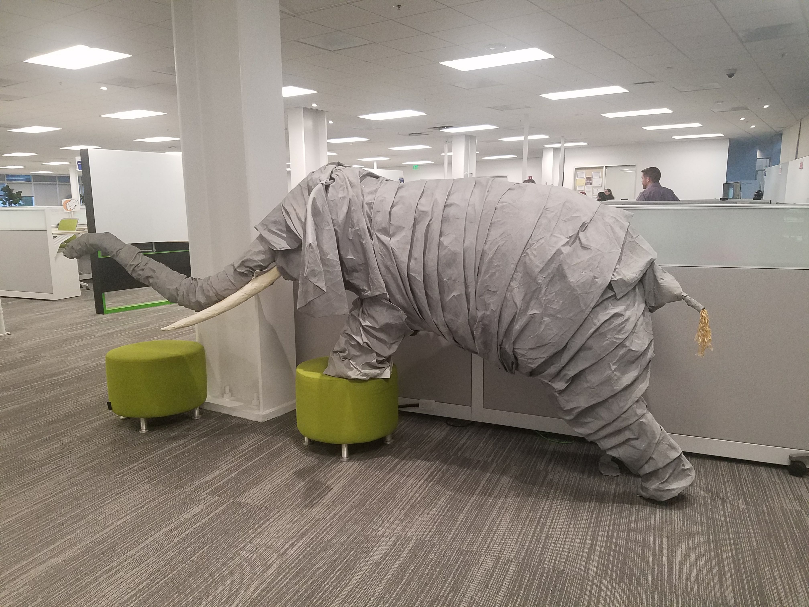

# TODO:

Update metadata

# Object Detection

## Introduction

Convolutional Neural Networks are [insert knowledge here]() and are used for [Drop Knowledge here]().

To the human brain this is an elephant, albeit a fake on but an elephant nonetheless, we know this because we are able to make associations with previous shapes we have seen before and infer what type of animal it is we are observing.
Similarly in this tutorial we will explore how a computer envisions the world around it, at least when it has been trained.

## Prerequisites

- Downloaded and deployed the [Hortonworks Data Platform (HDP)](https://hortonworks.com/downloads/#sandbox) Sandbox
- [TensorFlow on YARN](http://example.com/link/to/required/tutorial)

## Outline

- [Concepts](#concepts)
- [Section Title 1](#section-title-1)
- [Section Title 2](#section-title-2)
- [Summary](#summary)
- [Further Reading](#further-reading)
- [Appendix A: Troubleshoot](#appendix-a-troubleshoot)
- [Appendix B: Extra Features](#appendix-b-extra-features)

> Note: It may be good idea for each procedure to start with an action verb (e.g. Install, Create, Implement, etc.). Also note that for notes we use ">" to start a note. There are other ways to do it but this is our standard

## Concepts

Sometimes, it's a good idea to include a concepts section to go over core concepts before the real action begins.  That way:

- Readers get a preview of the tech that'll be introduced.
- The section can be used as a reference for terminology brought up throughout the tutorial.
- By the way, this is an example of a list.  Feel free to copy/paste this for your own use.
- Use a single space for lists, not tabs.
  - Also, a sub-list.

## Environment Setup

Have dependencies installed preferably in a virtual environment

~~~bash
pip3 install virtualenv
~~~

Make and activate your environment

~~~bash
mkdir ~/venvtf
virtualenv ~/venvtf
~~~

Source and activate

~~~bash
source ~/venvtf/bin/activate
~~~

Now for the good stuff

~~~bash
brew install python3
pip3 install numpy
pip3 install tensorflow-hub
~~~

### Import Data

Now that our environment has all the dependencies required we can bring in images to be processed.

~~~bash
scp something something or wget idk yet
~~~

## Run Inference

~~~python
#@title Imports and function definitions

# For local usage of this script
import os

# For running inference on the TF-Hub module.
import tensorflow as tf
import tensorflow_hub as hub

# For downloading the image.
import matplotlib.pyplot as plt
import tempfile
from six.moves.urllib.request import urlopen
from six import BytesIO

# For drawing onto the image.
import numpy as np
from PIL import Image
from PIL import ImageColor
from PIL import ImageDraw
from PIL import ImageFont
from PIL import ImageOps

# For measuring the inference time.
import time

# Check available GPU devices.
print("The following GPU devices are available: %s" % tf.test.gpu_device_name())

def draw_bounding_box_on_image(image,
                               ymin,
                               xmin,
                               ymax,
                               xmax,
                               color,
                               font,
                               thickness=4,
                               display_str_list=()):
  """Adds a bounding box to an image."""
  draw = ImageDraw.Draw(image)
  im_width, im_height = image.size
  (left, right, top, bottom) = (xmin * im_width, xmax * im_width,
                                ymin * im_height, ymax * im_height)
  draw.line([(left, top), (left, bottom), (right, bottom), (right, top),
             (left, top)],
            width=thickness,
            fill=color)

  # If the total height of the display strings added to the top of the bounding
  # box exceeds the top of the image, stack the strings below the bounding box
  # instead of above.
  display_str_heights = [font.getsize(ds)[1] for ds in display_str_list]
  # Each display_str has a top and bottom margin of 0.05x.
  total_display_str_height = (1 + 2 * 0.05) * sum(display_str_heights)

  if top > total_display_str_height:
    text_bottom = top
  else:
    text_bottom = bottom + total_display_str_height
  # Reverse list and print from bottom to top.
  for display_str in display_str_list[::-1]:
    text_width, text_height = font.getsize(display_str)
    margin = np.ceil(0.05 * text_height)
    draw.rectangle([(left, text_bottom - text_height - 2 * margin),
                    (left + text_width, text_bottom)],
                   fill=color)
    draw.text((left + margin, text_bottom - text_height - margin),
              display_str,
              fill="black",
              font=font)
    text_bottom -= text_height - 2 * margin

def draw_boxes(image, boxes, class_names, scores, max_boxes=10, min_score=0.1):
  """Overlay labeled boxes on an image with formatted scores and label names."""
  colors = list(ImageColor.colormap.values())

  try:
    font = ImageFont.truetype("/usr/share/fonts/truetype/liberation/LiberationSansNarrow-Regular.ttf",
                              25)
  except IOError:
    print("Font not found, using default font.")
    font = ImageFont.load_default()

  for i in range(min(boxes.shape[0], max_boxes)):
    if scores[i] >= min_score:
      ymin, xmin, ymax, xmax = tuple(boxes[i].tolist())
      display_str = "{}: {}%".format(class_names[i].decode("ascii"),
                                     int(100 * scores[i]))
      color = colors[hash(class_names[i]) % len(colors)]
      image_pil = Image.fromarray(np.uint8(image)).convert("RGB")
      draw_bounding_box_on_image(
          image_pil,
          ymin,
          xmin,
          ymax,
          xmax,
          color,
          font,
          display_str_list=[display_str])
      np.copyto(image, np.array(image_pil))

  return image

#downloaded_image_path = download_and_resize_image(image_url, 1280, 856, True)

def run_inference_sandbox_locally(localDir, im_type):
  #["https://tfhub.dev/google/openimages_v4/ssd/mobilenet_v2/1", "https://tfhub.dev/google/faster_rcnn/openimages_v4/inception_resnet_v2/1"]
  module_handle = "https://tfhub.dev/google/faster_rcnn/openimages_v4/inception_resnet_v2/1" 

  with tf.Graph().as_default():
    detector = hub.Module(module_handle)
    image_string_placeholder = tf.placeholder(tf.string)
    decoded_image = tf.image.decode_jpeg(image_string_placeholder)
    # Module accepts as input tensors of shape [1, height, width, 3], i.e. batch
    # of size 1 and type tf.float32.
    decoded_image_float = tf.image.convert_image_dtype(
        image=decoded_image, dtype=tf.float32)
    module_input = tf.expand_dims(decoded_image_float, 0)
    result = detector(module_input, as_dict=True)
    init_ops = [tf.global_variables_initializer(), tf.tables_initializer()]

    session = tf.Session()
    session.run(init_ops)

  # For files in the folder given, iter
  i = 0

  for filename in os.listdir(localDir):
    print(filename)
    if filename.endswith(im_type):
      with tf.gfile.Open(localDir+filename, "rb") as binfile:
        image_string = binfile.read()

        result_out, image_out = session.run(
            [result, decoded_image],
            feed_dict={image_string_placeholder: image_string})
        print("Found %d objects." % len(result_out["detection_scores"]))

      image_with_boxes = draw_boxes(
        np.array(image_out), result_out["detection_boxes"],
        result_out["detection_class_entities"], result_out["detection_scores"])

      # Needed as these images are converted into numpy arrays
      im = Image.fromarray(image_with_boxes)
      # Named files with original name as they are taken out of order
      # TODO: Remove file extension from name when storing
      im.save('/home/chris/tf/experiments/results/'+ filename +'.jpg')
      i += 1

if __name__ == '__main__':
  # Change image type for application (i.e. '.jpg', '.jpeg', '.JPEG')
  im_type = '.jpg'
  localDir = '/home/chris/Pictures/testimages/'
  run_inference_sandbox_locally(localDir, im_type)
~~~

## Summary

Congratulations, you've finished your first tutorial!  Including a review of the tutorial or tools they now know how to use would be helpful.

## Further Reading

- [Reference Article Title](https://example.com)
- [Title of Another Useful Tutorial](https://hortonworks.com)

> Note: A tutorial does not go as in depth as documentation, so we suggest you include links here to all documents you may have utilized to build this tutorial.

### Appendix A: Troubleshoot

The appendix covers optional components of the tutorial, including help sections that might come up that cover common issues.  Either include possible solutions to issues that may occur or point users to [helpful links](https://hortonworks.com) in case they run into problems.

### Appendix B: Extra Features

Include any other interesting features of the big data tool you are using.

Example: when learning to build a NiFi flow, we included the necessary steps required to process the data. NiFi also has additional features for adding labels to a flow to make it easier to follow.